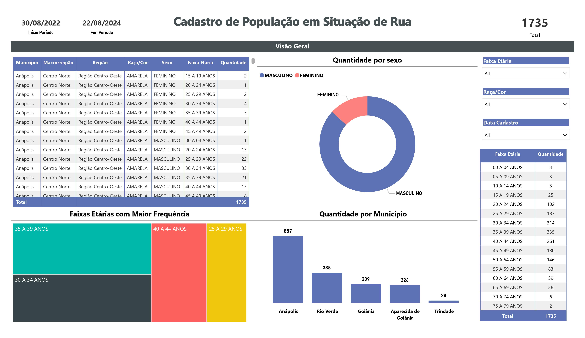

## Script ETL

Esse é o repositório onde está o script ETL: [Link para o Script ETL](https://github.com/Wiryco/analiticoTb/tree/main/etl)

## Dashboard em Power BI
URL da base de dados: [Link para dados públicos de saúde do Gov](https://dados.saude.go.gov.br/dataset/testes-e-experimentos/resource/cd2137a8-619a-4e56-87f3-33fa018be313)
Esse é o repositório onde está o dashboard em Power BI: [Link para o Dashboard Power BI](https://github.com/Wiryco/analiticoTb/tree/main/dash)

### Visualização do Dashboard

